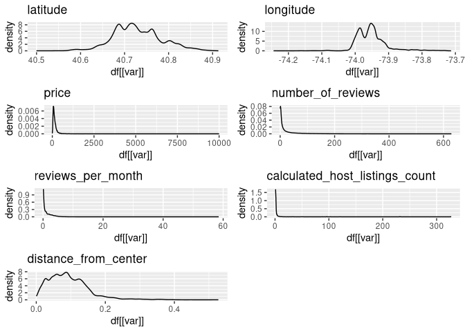
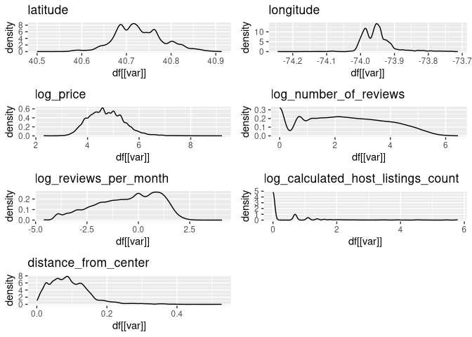
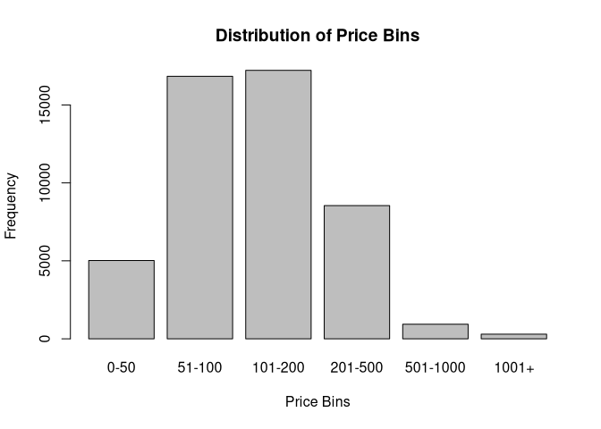

Data Cleaning
================

Load required packages.

``` r
library( tidyverse )
library( dplyr )
library( gridExtra )
```

Set up workspace, i.e., remove all existing data from working memory and
load data from CSV file.

``` r
rm( list=ls() )
df <- read.csv("./data/airbnb_data.csv")
```

# Transform data

Convert the room_type, neighborhood_group, and neighborhood variables
into factors and the last_review variable into a Date object.

``` r
head(df)
```

    ##     id                                             name host_id   host_name
    ## 1 2539               Clean & quiet apt home by the park    2787        John
    ## 2 2595                            Skylit Midtown Castle    2845    Jennifer
    ## 3 3647              THE VILLAGE OF HARLEM....NEW YORK !    4632   Elisabeth
    ## 4 3831                  Cozy Entire Floor of Brownstone    4869 LisaRoxanne
    ## 5 5022 Entire Apt: Spacious Studio/Loft by central park    7192       Laura
    ## 6 5099        Large Cozy 1 BR Apartment In Midtown East    7322       Chris
    ##   neighbourhood_group neighbourhood latitude longitude       room_type price
    ## 1            Brooklyn    Kensington 40.64749 -73.97237    Private room   149
    ## 2           Manhattan       Midtown 40.75362 -73.98377 Entire home/apt   225
    ## 3           Manhattan        Harlem 40.80902 -73.94190    Private room   150
    ## 4            Brooklyn  Clinton Hill 40.68514 -73.95976 Entire home/apt    89
    ## 5           Manhattan   East Harlem 40.79851 -73.94399 Entire home/apt    80
    ## 6           Manhattan   Murray Hill 40.74767 -73.97500 Entire home/apt   200
    ##   minimum_nights number_of_reviews last_review reviews_per_month
    ## 1              1                 9  2018-10-19              0.21
    ## 2              1                45  2019-05-21              0.38
    ## 3              3                 0                            NA
    ## 4              1               270  2019-07-05              4.64
    ## 5             10                 9  2018-11-19              0.10
    ## 6              3                74  2019-06-22              0.59
    ##   calculated_host_listings_count availability_365
    ## 1                              6              365
    ## 2                              2              355
    ## 3                              1              365
    ## 4                              1              194
    ## 5                              1                0
    ## 6                              1              129

``` r
df <- df %>%
  mutate(
    room_type = as.factor(room_type),
    neighbourhood_group = as.factor(neighbourhood_group),
    neighbourhood = as.factor(neighbourhood),
    last_review=as.Date(last_review, format = "%Y-%m-%d")
  )

str(df)
```

    ## 'data.frame':    48895 obs. of  16 variables:
    ##  $ id                            : int  2539 2595 3647 3831 5022 5099 5121 5178 5203 5238 ...
    ##  $ name                          : chr  "Clean & quiet apt home by the park" "Skylit Midtown Castle" "THE VILLAGE OF HARLEM....NEW YORK !" "Cozy Entire Floor of Brownstone" ...
    ##  $ host_id                       : int  2787 2845 4632 4869 7192 7322 7356 8967 7490 7549 ...
    ##  $ host_name                     : chr  "John" "Jennifer" "Elisabeth" "LisaRoxanne" ...
    ##  $ neighbourhood_group           : Factor w/ 5 levels "Bronx","Brooklyn",..: 2 3 3 2 3 3 2 3 3 3 ...
    ##  $ neighbourhood                 : Factor w/ 221 levels "Allerton","Arden Heights",..: 109 128 95 42 62 138 14 96 203 36 ...
    ##  $ latitude                      : num  40.6 40.8 40.8 40.7 40.8 ...
    ##  $ longitude                     : num  -74 -74 -73.9 -74 -73.9 ...
    ##  $ room_type                     : Factor w/ 3 levels "Entire home/apt",..: 2 1 2 1 1 1 2 2 2 1 ...
    ##  $ price                         : int  149 225 150 89 80 200 60 79 79 150 ...
    ##  $ minimum_nights                : int  1 1 3 1 10 3 45 2 2 1 ...
    ##  $ number_of_reviews             : int  9 45 0 270 9 74 49 430 118 160 ...
    ##  $ last_review                   : Date, format: "2018-10-19" "2019-05-21" ...
    ##  $ reviews_per_month             : num  0.21 0.38 NA 4.64 0.1 0.59 0.4 3.47 0.99 1.33 ...
    ##  $ calculated_host_listings_count: int  6 2 1 1 1 1 1 1 1 4 ...
    ##  $ availability_365              : int  365 355 365 194 0 129 0 220 0 188 ...

# Missing values

Count the number of missing values and calculate the percentage.

``` r
empty_values <- c(NA, NULL, "", " ")

get_na_summary <- function(df) {
  nrows = nrow(df)
  NAs <- data.frame()

  for (column_name in colnames(df)) {
    na_count <- sum(df[[column_name]] %in% empty_values)#is.na(df[[column_name]]))
    row <- data.frame(
      variable = column_name,
      na_count = na_count,
      na_percent = round(na_count / nrows, 4) 
    )
    NAs <- rbind(NAs, row)
  }

  return(NAs)
}

get_na_summary(df)
```

    ##                          variable na_count na_percent
    ## 1                              id        0     0.0000
    ## 2                            name       16     0.0003
    ## 3                         host_id        0     0.0000
    ## 4                       host_name       21     0.0004
    ## 5             neighbourhood_group        0     0.0000
    ## 6                   neighbourhood        0     0.0000
    ## 7                        latitude        0     0.0000
    ## 8                       longitude        0     0.0000
    ## 9                       room_type        0     0.0000
    ## 10                          price        0     0.0000
    ## 11                 minimum_nights        0     0.0000
    ## 12              number_of_reviews        0     0.0000
    ## 13                    last_review    10052     0.2056
    ## 14              reviews_per_month    10052     0.2056
    ## 15 calculated_host_listings_count        0     0.0000
    ## 16               availability_365        0     0.0000

Defining a function to filter out rows where variables contain missing
values. Missing values in reviews_per_month are replaced with 0,
assuming no review means zero reviews per month. Keep only rows without
empty values in the name and host_name variables. Check the dataframe
again for missing values after the cleaning.

``` r
`%nin%` = Negate(`%in%`)

df <- df %>%
  mutate(reviews_per_month = ifelse(is.na(reviews_per_month), 0, reviews_per_month)) %>%
  filter(name %nin% empty_values) %>%
  filter(host_name %nin% empty_values)

get_na_summary(df)
```

    ##                          variable na_count na_percent
    ## 1                              id        0     0.0000
    ## 2                            name        0     0.0000
    ## 3                         host_id        0     0.0000
    ## 4                       host_name        0     0.0000
    ## 5             neighbourhood_group        0     0.0000
    ## 6                   neighbourhood        0     0.0000
    ## 7                        latitude        0     0.0000
    ## 8                       longitude        0     0.0000
    ## 9                       room_type        0     0.0000
    ## 10                          price        0     0.0000
    ## 11                 minimum_nights        0     0.0000
    ## 12              number_of_reviews        0     0.0000
    ## 13                    last_review    10037     0.2054
    ## 14              reviews_per_month        0     0.0000
    ## 15 calculated_host_listings_count        0     0.0000
    ## 16               availability_365        0     0.0000

# Feature Engineering

Create a variable that adds the most recent review date available in the
dataset and store it in latest_review.

``` r
latest_review <- df %>%
  filter(!is.na(last_review)) %>%
  summarise(max(last_review))
latest_review <- latest_review[1,]
```

Create a variable that contains the distance to the “center” of New York
in Manhattan, here defined as the Columbus Circle.

``` r
center_latitude <- 40.767811385445356
center_longitude <- -73.98156481716236

manhatten_distance <- function(x1, y1, x2, y2) {
  return(abs(x1 - x2) + abs(y1 - y2))  
}
```

Create a variable that indicates the time passed since the last review.
Another variable reflects the distance from the Columbus Circle in
Manhattan. Add both to the dataframe.

``` r
df <- df %>%
  mutate(
    last_review_age = latest_review - last_review,
    distance_from_center = manhatten_distance(center_latitude, center_longitude, latitude, longitude)  
  )

head(df)
```

    ##     id                                             name host_id   host_name
    ## 1 2539               Clean & quiet apt home by the park    2787        John
    ## 2 2595                            Skylit Midtown Castle    2845    Jennifer
    ## 3 3647              THE VILLAGE OF HARLEM....NEW YORK !    4632   Elisabeth
    ## 4 3831                  Cozy Entire Floor of Brownstone    4869 LisaRoxanne
    ## 5 5022 Entire Apt: Spacious Studio/Loft by central park    7192       Laura
    ## 6 5099        Large Cozy 1 BR Apartment In Midtown East    7322       Chris
    ##   neighbourhood_group neighbourhood latitude longitude       room_type price
    ## 1            Brooklyn    Kensington 40.64749 -73.97237    Private room   149
    ## 2           Manhattan       Midtown 40.75362 -73.98377 Entire home/apt   225
    ## 3           Manhattan        Harlem 40.80902 -73.94190    Private room   150
    ## 4            Brooklyn  Clinton Hill 40.68514 -73.95976 Entire home/apt    89
    ## 5           Manhattan   East Harlem 40.79851 -73.94399 Entire home/apt    80
    ## 6           Manhattan   Murray Hill 40.74767 -73.97500 Entire home/apt   200
    ##   minimum_nights number_of_reviews last_review reviews_per_month
    ## 1              1                 9  2018-10-19              0.21
    ## 2              1                45  2019-05-21              0.38
    ## 3              3                 0        <NA>              0.00
    ## 4              1               270  2019-07-05              4.64
    ## 5             10                 9  2018-11-19              0.10
    ## 6              3                74  2019-06-22              0.59
    ##   calculated_host_listings_count availability_365 last_review_age
    ## 1                              6              365        262 days
    ## 2                              2              355         48 days
    ## 3                              1              365         NA days
    ## 4                              1              194          3 days
    ## 5                              1                0        231 days
    ## 6                              1              129         16 days
    ##   distance_from_center
    ## 1           0.12951620
    ## 2           0.01639657
    ## 3           0.08087343
    ## 4           0.10447620
    ## 5           0.06827343
    ## 6           0.02670620

Generate kernel density estimates for each variable in the dataframe to
assess their distributions.

``` r
plot_distributions <- function(df) {
  plots <- lapply(names(df), function(var) {
    ggplot(df, aes(x = df[[var]])) +
      geom_density() + # You can also use geom_histogram() for histograms
      labs(title = var)
  })
  grid.arrange(grobs = plots, ncol = 2)
}

df_sample <- df %>%
  select(latitude, longitude, price, number_of_reviews, reviews_per_month, calculated_host_listings_count,  distance_from_center)

plot_distributions(df_sample)
```

    ## Warning: Use of `df[[var]]` is discouraged.
    ## ℹ Use `.data[[var]]` instead.
    ## Use of `df[[var]]` is discouraged.
    ## ℹ Use `.data[[var]]` instead.
    ## Use of `df[[var]]` is discouraged.
    ## ℹ Use `.data[[var]]` instead.
    ## Use of `df[[var]]` is discouraged.
    ## ℹ Use `.data[[var]]` instead.
    ## Use of `df[[var]]` is discouraged.
    ## ℹ Use `.data[[var]]` instead.
    ## Use of `df[[var]]` is discouraged.
    ## ℹ Use `.data[[var]]` instead.
    ## Use of `df[[var]]` is discouraged.
    ## ℹ Use `.data[[var]]` instead.

<!-- -->

Log transforme skewed distributions.

``` r
df_log <- df %>%
  mutate(
    log_price = log(price),
    log_number_of_reviews = log(number_of_reviews),
    log_reviews_per_month = log(reviews_per_month),
    log_calculated_host_listings_count = log(calculated_host_listings_count)
  )

df_sample <- df_log %>%
  select(
    latitude, longitude, log_price, log_number_of_reviews, log_reviews_per_month, log_calculated_host_listings_count, distance_from_center
  )

plot_distributions(df_sample)
```

    ## Warning: Use of `df[[var]]` is discouraged.
    ## ℹ Use `.data[[var]]` instead.
    ## Use of `df[[var]]` is discouraged.
    ## ℹ Use `.data[[var]]` instead.
    ## Use of `df[[var]]` is discouraged.
    ## ℹ Use `.data[[var]]` instead.

    ## Warning: Removed 11 rows containing non-finite values (`stat_density()`).

    ## Warning: Use of `df[[var]]` is discouraged.
    ## ℹ Use `.data[[var]]` instead.

    ## Warning: Removed 10037 rows containing non-finite values (`stat_density()`).

    ## Warning: Use of `df[[var]]` is discouraged.
    ## ℹ Use `.data[[var]]` instead.

    ## Warning: Removed 10037 rows containing non-finite values (`stat_density()`).

    ## Warning: Use of `df[[var]]` is discouraged.
    ## ℹ Use `.data[[var]]` instead.
    ## Use of `df[[var]]` is discouraged.
    ## ℹ Use `.data[[var]]` instead.

<!-- -->

Save the modified data to the dataframe.

``` r
df <- df_log
```

Bin price and check the distribution across bins.

``` r
bins <- c(0, 50, 100, 200, 500, 1000, 10000)
labels <- c("0-50", "51-100", "101-200", "201-500", "501-1000", "1001+")
df$price_bin <- cut(df$price, breaks = bins, labels = labels, include.lowest = TRUE, right = FALSE)
table(df$price_bin)
```

    ## 
    ##     0-50   51-100  101-200  201-500 501-1000    1001+ 
    ##     5022    16839    17219     8543      937      298

``` r
barplot(table(df$price_bin), main="Distribution of Price Bins", xlab="Price Bins", ylab="Frequency")
```

<!-- -->

The listings are distributed across the bins, though there is less data
for the two highest price categories. Most listings are in bins 2 and 3,
i.e., between \$51 and \$500. The adjacent bins 1 and 4 are also
well-represented.

# Consistency

## Min/max

Summarize the data.

``` r
df_numeric <- df %>%
  select(
    latitude, longitude, price, minimum_nights, number_of_reviews, last_review, reviews_per_month, 
    calculated_host_listings_count, availability_365, last_review_age, distance_from_center
  )

summary(df_numeric)
```

    ##     latitude       longitude          price         minimum_nights    
    ##  Min.   :40.50   Min.   :-74.24   Min.   :    0.0   Min.   :   1.000  
    ##  1st Qu.:40.69   1st Qu.:-73.98   1st Qu.:   69.0   1st Qu.:   1.000  
    ##  Median :40.72   Median :-73.96   Median :  106.0   Median :   3.000  
    ##  Mean   :40.73   Mean   :-73.95   Mean   :  152.7   Mean   :   7.012  
    ##  3rd Qu.:40.76   3rd Qu.:-73.94   3rd Qu.:  175.0   3rd Qu.:   5.000  
    ##  Max.   :40.91   Max.   :-73.71   Max.   :10000.0   Max.   :1250.000  
    ##                                                                       
    ##  number_of_reviews  last_review         reviews_per_month
    ##  Min.   :  0.00    Min.   :2011-03-28   Min.   : 0.000   
    ##  1st Qu.:  1.00    1st Qu.:2018-07-09   1st Qu.: 0.040   
    ##  Median :  5.00    Median :2019-05-19   Median : 0.370   
    ##  Mean   : 23.27    Mean   :2018-10-04   Mean   : 1.091   
    ##  3rd Qu.: 24.00    3rd Qu.:2019-06-23   3rd Qu.: 1.580   
    ##  Max.   :629.00    Max.   :2019-07-08   Max.   :58.500   
    ##                    NA's   :10037                         
    ##  calculated_host_listings_count availability_365 last_review_age  
    ##  Min.   :  1.000                Min.   :  0.0    Length:48858     
    ##  1st Qu.:  1.000                1st Qu.:  0.0    Class :difftime  
    ##  Median :  1.000                Median : 45.0    Mode  :numeric   
    ##  Mean   :  7.148                Mean   :112.8                     
    ##  3rd Qu.:  2.000                3rd Qu.:227.0                     
    ##  Max.   :327.000                Max.   :365.0                     
    ##                                                                   
    ##  distance_from_center
    ##  Min.   :0.0005438   
    ##  1st Qu.:0.0509034   
    ##  Median :0.0859048   
    ##  Mean   :0.0936561   
    ##  3rd Qu.:0.1250616   
    ##  Max.   :0.5272966   
    ## 

All numeric variables (except longitude) have non-negative values. Max
for availability_365 is 365.

## Price

Price: Minimum value of 0, likely indicating missing data rather than
actual free listings. Minimum Nights: A maximum of 1250 nights suggests
potential outliers.

Check entries with price equal to 0.

``` r
df %>%
  filter(price == 0)
```

    ##          id                                               name   host_id
    ## 1  18750597  Huge Brooklyn Brownstone Living, Close to it all.   8993084
    ## 2  20333471      ★Hostel Style Room | Ideal Traveling Buddies★ 131697576
    ## 3  20523843    MARTIAL LOFT 3: REDEMPTION (upstairs, 2nd room)  15787004
    ## 4  20608117                    Sunny, Quiet Room in Greenpoint   1641537
    ## 5  20624541      Modern apartment in the heart of Williamsburg  10132166
    ## 6  20639628 Spacious comfortable master bedroom with nice view  86327101
    ## 7  20639792  Contemporary bedroom in brownstone with nice view  86327101
    ## 8  20639914       Cozy yet spacious private brownstone bedroom  86327101
    ## 9  20933849                              the best you can find  13709292
    ## 10 21291569  Coliving in Brooklyn! Modern design / Shared room 101970559
    ## 11 21304320             Best Coliving space ever! Shared room. 101970559
    ##       host_name neighbourhood_group      neighbourhood latitude longitude
    ## 1      Kimberly            Brooklyn Bedford-Stuyvesant 40.69023 -73.95428
    ## 2        Anisha               Bronx    East Morrisania 40.83296 -73.88668
    ## 3  Martial Loft            Brooklyn           Bushwick 40.69467 -73.92433
    ## 4        Lauren            Brooklyn         Greenpoint 40.72462 -73.94072
    ## 5       Aymeric            Brooklyn       Williamsburg 40.70838 -73.94645
    ## 6       Adeyemi            Brooklyn Bedford-Stuyvesant 40.68173 -73.91342
    ## 7       Adeyemi            Brooklyn Bedford-Stuyvesant 40.68279 -73.91170
    ## 8       Adeyemi            Brooklyn Bedford-Stuyvesant 40.68258 -73.91284
    ## 9        Qiuchi           Manhattan        Murray Hill 40.75091 -73.97597
    ## 10       Sergii            Brooklyn           Bushwick 40.69211 -73.90670
    ## 11       Sergii            Brooklyn           Bushwick 40.69166 -73.90928
    ##          room_type price minimum_nights number_of_reviews last_review
    ## 1     Private room     0              4                 1  2018-01-06
    ## 2     Private room     0              2                55  2019-06-24
    ## 3     Private room     0              2                16  2019-05-18
    ## 4     Private room     0              2                12  2017-10-27
    ## 5  Entire home/apt     0              5                 3  2018-01-02
    ## 6     Private room     0              1                93  2019-06-15
    ## 7     Private room     0              1                95  2019-06-21
    ## 8     Private room     0              1                95  2019-06-23
    ## 9  Entire home/apt     0              3                 0        <NA>
    ## 10     Shared room     0             30                 2  2019-06-22
    ## 11     Shared room     0             30                 5  2019-05-24
    ##    reviews_per_month calculated_host_listings_count availability_365
    ## 1               0.05                              4               28
    ## 2               2.56                              4              127
    ## 3               0.71                              5                0
    ## 4               0.53                              2                0
    ## 5               0.15                              1               73
    ## 6               4.28                              6              176
    ## 7               4.37                              6              232
    ## 8               4.35                              6              222
    ## 9               0.00                              1                0
    ## 10              0.11                              6              333
    ## 11              0.26                              6              139
    ##    last_review_age distance_from_center log_price log_number_of_reviews
    ## 1         548 days            0.1048662      -Inf             0.0000000
    ## 2          14 days            0.1600334      -Inf             4.0073332
    ## 3          51 days            0.1303762      -Inf             2.7725887
    ## 4         619 days            0.0840362      -Inf             2.4849066
    ## 5         552 days            0.0945462      -Inf             1.0986123
    ## 6          23 days            0.1542262      -Inf             4.5325995
    ## 7          17 days            0.1548862      -Inf             4.5538769
    ## 8          15 days            0.1539562      -Inf             4.5538769
    ## 9          NA days            0.0224962      -Inf                  -Inf
    ## 10         16 days            0.1505662      -Inf             0.6931472
    ## 11         45 days            0.1484362      -Inf             1.6094379
    ##    log_reviews_per_month log_calculated_host_listings_count price_bin
    ## 1             -2.9957323                          1.3862944      0-50
    ## 2              0.9400073                          1.3862944      0-50
    ## 3             -0.3424903                          1.6094379      0-50
    ## 4             -0.6348783                          0.6931472      0-50
    ## 5             -1.8971200                          0.0000000      0-50
    ## 6              1.4539530                          1.7917595      0-50
    ## 7              1.4747630                          1.7917595      0-50
    ## 8              1.4701758                          1.7917595      0-50
    ## 9                   -Inf                          0.0000000      0-50
    ## 10            -2.2072749                          1.7917595      0-50
    ## 11            -1.3470736                          1.7917595      0-50

Since there are only 11 listings with a price of zero, we assume this is
a data gathering error and remove the respective rows.

``` r
df <- df_non_zero_price <- df %>% 
  filter(price != 0)
```

## Minimum nights

``` r
max(df$minimum_nights)
```

    ## [1] 1250

The maximum for the variable minimum_nights is 1250, meaning that
particular listing would have to be rented as a minimum for well over 3
years. This seems excessive as AirBnB in most cases is used for holidays
or short to mid stays. We do not see a reason for a host to require the
listing to be rented for such a long time and thus will consider it and
similar entries as data anomalies.

``` r
quantile(df$minimum_nights, 0.9999)
```

    ## 99.99% 
    ##    500

The minimum required nights is less than 500 for 99.99% of all listing.
This number seems more or less reasonable. In the following we will
therefore remove all entries that fall above this threshold.

``` r
df <- df %>%
  filter(minimum_nights <= quantile(minimum_nights, 0.9999))
```

## Unique ids

Compare the number of rows and the number of unique ids to determine
whether each row has a unique identifier.

``` r
length_df <- nrow(df)
unique_ids <- length(unique(df$id))

length_df == unique_ids
```

    ## [1] TRUE

There are no id inconsistencies.

## Reviews

Filter the dataframe to find entries where reviews_per_month is 0 but
number_of_reviews is not 0, find entries with 0 number_of_reviews but a
non-NA last_review date and identify rows where reviews_per_month is 0
but last_review is not NA.

``` r
result <- df %>%
  filter(
    reviews_per_month == 0, 
    number_of_reviews != 0
  )

nrow(result)
```

    ## [1] 0

``` r
result <- df %>%
  filter(
    number_of_reviews == 0,
    !is.na(last_review)
  )

nrow(result)
```

    ## [1] 0

``` r
result <- df %>%
  filter(
    reviews_per_month == 0,
    !is.na(last_review)
  )

nrow(result)
```

    ## [1] 0

All review variables are internally consistent.

# Duplicates

Find duplicates based on the id column and identify listings that are at
the exact same location.

``` r
get_duplicates_by_columns <- function(df, column_names) {
  column_indexes <- unlist(lapply(column_names, function(name) {
    return (grep(name, colnames(df)))
  })) 
  
  return (df[duplicated(df[,column_indexes]) | duplicated(df[,column_indexes], fromLast = TRUE),])
}
```

## Duplicate ids

``` r
nrow(get_duplicates_by_columns(df, c("id")))
```

    ## [1] 0

## Duplicate names

``` r
get_duplicates_by_columns(df, c("name")) %>%
  select(id, name, host_name, neighbourhood, price) %>%
  arrange(desc(name))
```

    ##           id
    ## 1   34692728
    ## 2   34737337
    ## 3   34771161
    ## 4   13435688
    ## 5   17510139
    ## 6   17510140
    ## 7   17510141
    ## 8     219793
    ## 9     219818
    ## 10  36003858
    ## 11  36039574
    ## 12   3339399
    ## 13   3791244
    ## 14  29414633
    ## 15  31332746
    ## 16  29900395
    ## 17  29900755
    ## 18  15983444
    ## 19  21364301
    ## 20  13522948
    ## 21  18423938
    ## 22  13114072
    ## 23  13389280
    ## 24  34895344
    ## 25  12869567
    ## 26  26056703
    ## 27  13078166
    ## 28  20204055
    ## 29  21306332
    ## 30  12869561
    ## 31  35463471
    ## 32   7048508
    ## 33   8410796
    ## 34   8445883
    ## 35   9218051
    ## 36  13125150
    ## 37  18425106
    ## 38  30156697
    ## 39  30156908
    ## 40  33734483
    ## 41  33982630
    ## 42  35490967
    ## 43  31876724
    ## 44  31987806
    ## 45  35946932
    ## 46  36372006
    ## 47  22453527
    ## 48  32503407
    ## 49  22005115
    ## 50  34014939
    ## 51  34117732
    ## 52  34199411
    ## 53    250536
    ## 54    250537
    ## 55  21715735
    ## 56  30175521
    ## 57  24428060
    ## 58  24498097
    ## 59     77765
    ## 60     84010
    ## 61    253846
    ## 62  33907604
    ## 63  33932313
    ## 64   8552070
    ## 65  20450185
    ## 66  35408591
    ## 67  35425034
    ## 68  23078446
    ## 69  23086483
    ## 70  35740468
    ## 71  35741268
    ## 72  27015441
    ## 73  27015464
    ## 74  10611168
    ## 75  12409217
    ## 76   9298895
    ## 77  10031436
    ## 78    449034
    ## 79   1330056
    ## 80  33717547
    ## 81  34286519
    ## 82  33717639
    ## 83  34205286
    ## 84  32466778
    ## 85  32740310
    ## 86  32590792
    ## 87  34212511
    ## 88  34175707
    ## 89  34312320
    ## 90  34323571
    ## 91  34323711
    ## 92  34183825
    ## 93  34203594
    ## 94  34311549
    ## 95  34323638
    ## 96  33708600
    ## 97  34181682
    ## 98  34341669
    ## 99  34570816
    ## 100 23041312
    ## 101 26571706
    ## 102 13108192
    ## 103 15767882
    ## 104 16405632
    ## 105 12885921
    ## 106 13108191
    ## 107 16405668
    ## 108 10922889
    ## 109 31145928
    ## 110 21314338
    ## 111 21340451
    ## 112 20688793
    ## 113 20827640
    ## 114 33775328
    ## 115 33775765
    ## 116 34353572
    ## 117 34353944
    ## 118 34340833
    ## 119 34341449
    ## 120 22961764
    ## 121 30745402
    ## 122 33457366
    ## 123 33457731
    ## 124  1617488
    ## 125 30924308
    ## 126  1147507
    ## 127 29966643
    ## 128 20303322
    ## 129 20304193
    ## 130 24833279
    ## 131 24834058
    ## 132 22260561
    ## 133 23285672
    ## 134 23902562
    ## 135 33590374
    ## 136  7692660
    ## 137 19326306
    ## 138  7502146
    ## 139  7734670
    ## 140 28872377
    ## 141  6947017
    ## 142  6947477
    ## 143  1118031
    ## 144 14420353
    ## 145 17447168
    ## 146 35162306
    ## 147  3435260
    ## 148 23918916
    ## 149 26837823
    ## 150 28031654
    ## 151 31340955
    ## 152 31341298
    ## 153 22077632
    ## 154 24349922
    ## 155 32892533
    ## 156 34315235
    ## 157  3857180
    ## 158  7434316
    ## 159 13171703
    ## 160 14355768
    ## 161 35136523
    ## 162 35136809
    ## 163 29393371
    ## 164 29412276
    ## 165 27579796
    ## 166 29828614
    ## 167 28730581
    ## 168 34936509
    ## 169 26743638
    ## 170 26810815
    ## 171 26989176
    ## 172 27483961
    ## 173 35462054
    ## 174 35462273
    ## 175  8054277
    ## 176 11530901
    ## 177 34485737
    ## 178 34485740
    ## 179 29186254
    ## 180 30928305
    ## 181 13550201
    ## 182 13694129
    ## 183 17510128
    ## 184 18159239
    ## 185 13444884
    ## 186 18094311
    ## 187 28971081
    ## 188 30109089
    ## 189 25610990
    ## 190 35170369
    ## 191   573671
    ## 192  4303600
    ## 193  6303845
    ## 194  6304002
    ## 195 11186765
    ## 196 25943177
    ## 197 34369607
    ## 198 34392044
    ## 199 34211618
    ## 200 34323686
    ## 201 29852201
    ## 202 30071389
    ## 203    80700
    ## 204    81739
    ## 205   253839
    ## 206   253466
    ## 207   253471
    ## 208   253475
    ## 209   253803
    ## 210   253806
    ## 211   253811
    ## 212   253815
    ## 213   294227
    ## 214   294242
    ## 215   294263
    ## 216   294280
    ## 217   248865
    ## 218   253800
    ## 219   294259
    ## 220   294490
    ## 221 29609716
    ## 222 29609786
    ## 223  4350464
    ## 224  9588699
    ## 225 25610763
    ## 226 27925678
    ## 227   453317
    ## 228   464231
    ## 229 24734792
    ## 230 24894476
    ## 231 16854754
    ## 232 32091007
    ## 233 28121527
    ## 234 30369494
    ## 235 29678364
    ## 236 29679067
    ## 237 29682577
    ## 238 28043195
    ## 239 28183270
    ## 240 34203595
    ## 241 35005936
    ## 242 20686701
    ## 243 20753634
    ## 244 20755049
    ## 245 20755691
    ## 246 20757749
    ## 247 20766398
    ## 248 34019712
    ## 249 34020040
    ## 250 22067826
    ## 251 27929288
    ## 252 19456810
    ## 253 19785737
    ## 254 21231543
    ## 255 21243952
    ## 256 21244035
    ## 257 21311903
    ## 258 21312075
    ## 259 21312191
    ## 260 21312225
    ## 261 21312283
    ## 262 21312330
    ## 263 21312403
    ## 264 21312440
    ## 265 21312495
    ## 266 21312549
    ## 267 21312595
    ## 268 21312687
    ## 269 21312732
    ## 270 26719190
    ## 271 28862464
    ## 272 13891485
    ## 273 18105293
    ## 274   158061
    ## 275   798008
    ## 276 18579690
    ## 277 20031965
    ## 278    17693
    ## 279  2138787
    ## 280 29104053
    ## 281 29152320
    ## 282 33400202
    ## 283 33406188
    ## 284 33406274
    ## 285 30590895
    ## 286 30593915
    ## 287 32093515
    ## 288 32094042
    ## 289 15249671
    ## 290 22809557
    ## 291 12983699
    ## 292 29540687
    ## 293 12832371
    ## 294 21148292
    ## 295 21184304
    ## 296 12832899
    ## 297 16805103
    ## 298 18103710
    ## 299 12833187
    ## 300 13510347
    ## 301 21483857
    ## 302 13542768
    ## 303 13544023
    ## 304 13167017
    ## 305 19153982
    ## 306    80684
    ## 307   253828
    ## 308 13073569
    ## 309 31305014
    ## 310 32667713
    ## 311 34213836
    ## 312 33688029
    ## 313 33845393
    ## 314 33988643
    ## 315 27429253
    ## 316 35236345
    ## 317 33694626
    ## 318 33694628
    ## 319 33694634
    ## 320 31125857
    ## 321 31295524
    ## 322 32696766
    ## 323 32844387
    ## 324 19313134
    ## 325 19768829
    ## 326 11044453
    ## 327 32207083
    ## 328 24525886
    ## 329 26249544
    ## 330 13209699
    ## 331 13427658
    ## 332 36381008
    ## 333 36382847
    ## 334 21984139
    ## 335 21984170
    ## 336 31885563
    ## 337 35267137
    ## 338 33491210
    ## 339 33653735
    ## 340 16703749
    ## 341 17993419
    ## 342 19072587
    ## 343 19079187
    ## 344  5902510
    ## 345 14085389
    ## 346 22295960
    ## 347 22296097
    ## 348  7293506
    ## 349  8653999
    ## 350 23827905
    ## 351 25510738
    ## 352 26703677
    ## 353 27301638
    ## 354  7227435
    ## 355  8698962
    ## 356 14888012
    ## 357 21631186
    ## 358 18326238
    ## 359 19800250
    ## 360 25053445
    ## 361 35281731
    ## 362 14596236
    ## 363 19055440
    ## 364 33995462
    ## 365 35035202
    ## 366  4686821
    ## 367 35966653
    ## 368 30388011
    ## 369 30392677
    ## 370  7024079
    ## 371  7050316
    ## 372 33230088
    ## 373 33230303
    ## 374 20435261
    ## 375 20469589
    ## 376  7715342
    ## 377 14802377
    ## 378   482765
    ## 379  7025693
    ## 380  6500246
    ## 381 18911893
    ## 382  9896731
    ## 383  9902915
    ## 384  9374263
    ## 385 21054012
    ## 386 35460630
    ## 387 35460924
    ## 388 35461013
    ## 389 35461373
    ## 390 35461466
    ## 391 35461527
    ## 392 35461620
    ## 393 35461700
    ## 394 35461822
    ## 395 35461960
    ## 396 17842115
    ## 397 19200160
    ## 398 33580893
    ## 399 33580907
    ## 400 34483424
    ## 401 34483426
    ## 402 34483439
    ## 403 34483443
    ## 404 17255171
    ## 405 17366042
    ## 406 21972082
    ## 407 31146079
    ## 408 21311240
    ## 409 21524489
    ## 410 24527051
    ## 411 26401639
    ## 412 33400613
    ## 413 33406391
    ## 414 25207662
    ## 415 25264929
    ## 416 28433844
    ## 417 33399665
    ## 418 33399897
    ## 419 20686099
    ## 420 20809807
    ## 421 20810529
    ## 422 20811696
    ## 423 22571719
    ## 424 22681018
    ## 425 22687843
    ## 426 34472646
    ## 427 34478598
    ## 428 36139806
    ## 429  9824042
    ## 430 24230591
    ## 431 14716155
    ## 432 14716586
    ## 433 14733932
    ## 434 26168027
    ## 435 23754635
    ## 436 24976971
    ## 437 33216329
    ## 438 33241978
    ## 439 27237604
    ## 440 27237625
    ##                                                                     name
    ## 1                   步行9分钟到法拉盛缅街中心的电梯房,提供免费矿泉水可乐
    ## 2                   步行9分钟到法拉盛缅街中心的电梯房,提供免费矿泉水可乐
    ## 3                   步行9分钟到法拉盛缅街中心的电梯房,提供免费矿泉水可乐
    ## 4                                   ❤ of Manhattan | Fantastic 1 Bedroom
    ## 5                                   ❤ of Manhattan | Fantastic 1 Bedroom
    ## 6                                   ❤ of Manhattan | Fantastic 1 Bedroom
    ## 7                                   ❤ of Manhattan | Fantastic 1 Bedroom
    ## 8                                     ✿✿✿ COUNTRY COTTAGE IN THE CITY✿✿✿
    ## 9                                     ✿✿✿ COUNTRY COTTAGE IN THE CITY✿✿✿
    ## 10                                    ★Premier Queen Room with Balcony ★
    ## 11                                    ★Premier Queen Room with Balcony ★
    ## 12                                          west village 1BR!best value!
    ## 13                                          west village 1BR!best value!
    ## 14                                                          private room
    ## 15                                                          private room
    ## 16                                   Your Manhattan Home: 12 mins to NYC
    ## 17                                   Your Manhattan Home: 12 mins to NYC
    ## 18                    Wonderful Private Room with Spacious Outdoor Patio
    ## 19                    Wonderful Private Room with Spacious Outdoor Patio
    ## 20                               West 74th Street, Svcd Studio Apartment
    ## 21                               West 74th Street, Svcd Studio Apartment
    ## 22                          West 55th street, Lux 1bd Serviced Apartment
    ## 23                          West 55th street, Lux 1bd Serviced Apartment
    ## 24                          West 55th street, Lux 1bd Serviced Apartment
    ## 25                          West 33rd street, Lux 1bd Serviced Apartment
    ## 26                          West 33rd street, Lux 1bd Serviced Apartment
    ## 27                     West 15th Street Cozy Chelsea Studio Serviced Apt
    ## 28                     West 15th Street Cozy Chelsea Studio Serviced Apt
    ## 29                     West 15th Street Cozy Chelsea Studio Serviced Apt
    ## 30                        West 15th Street Cozy Chelsea 1bd Serviced Apt
    ## 31                        West 15th Street Cozy Chelsea 1bd Serviced Apt
    ## 32                                   Welcoming, Clean, Cheap on St Marks
    ## 33                                   Welcoming, Clean, Cheap on St Marks
    ## 34                                   Welcoming, Clean, Cheap on St Marks
    ## 35                                   Welcoming, Clean, Cheap on St Marks
    ## 36                    Washington Street, Lux Svcd Studio in West Village
    ## 37                    Washington Street, Lux Svcd Studio in West Village
    ## 38                    WEST VILLAGE Bohemian flat in neo-Tudor town house
    ## 39                    WEST VILLAGE Bohemian flat in neo-Tudor town house
    ## 40                    WEST VILLAGE Bohemian flat in neo-Tudor town house
    ## 41                    WEST VILLAGE Bohemian flat in neo-Tudor town house
    ## 42                    WEST VILLAGE Bohemian flat in neo-Tudor town house
    ## 43                                Vibrant Bedroom in Upper West Side 107
    ## 44                                Vibrant Bedroom in Upper West Side 107
    ## 45                    Very Clean Private Room Near Buses & Restaurants!!
    ## 46                    Very Clean Private Room Near Buses & Restaurants!!
    ## 47                        Union SQ/Cozy & Quiet Room ! 5mins to Times SQ
    ## 48                        Union SQ/Cozy & Quiet Room ! 5mins to Times SQ
    ## 49                                 Two floor apartment near Central Park
    ## 50                                 Two floor apartment near Central Park
    ## 51                      Tons of Bars & Cafes nearby! Quick Walk to Metro
    ## 52                      Tons of Bars & Cafes nearby! Quick Walk to Metro
    ## 53                                                   The Lenox in Harlem
    ## 54                                                   The Lenox in Harlem
    ## 55                                         The BEST LOCATION in Brooklyn
    ## 56                                         The BEST LOCATION in Brooklyn
    ## 57                                             Sweet Home Away From Home
    ## 58                                             Sweet Home Away From Home
    ## 59                                                  Superior @ Box House
    ## 60                                                  Superior @ Box House
    ## 61                                                  Superior @ Box House
    ## 62                                Sunny Private BR in Ridgewood Woodbine
    ## 63                                Sunny Private BR in Ridgewood Woodbine
    ## 64                                                 Sunny Greenpoint Room
    ## 65                                                 Sunny Greenpoint Room
    ## 66                                      Stylish studio by Fulton station
    ## 67                                      Stylish studio by Fulton station
    ## 68                    Stylish 1 Bedroom Apt. for 4 p/ NYC - Murray Hill!
    ## 69                    Stylish 1 Bedroom Apt. for 4 p/ NYC - Murray Hill!
    ## 70                    Studio at Hilton Club Residence - Manhattan's Best
    ## 71                    Studio at Hilton Club Residence - Manhattan's Best
    ## 72                                                      Studio Penthouse
    ## 73                                                      Studio Penthouse
    ## 74                                               Studio Near Time Square
    ## 75                                               Studio Near Time Square
    ## 76                                   Spacious Sunny room in East Village
    ## 77                                   Spacious Sunny room in East Village
    ## 78                                   Spacious Loft 5 min to Union Square
    ## 79                                   Spacious Loft 5 min to Union Square
    ## 80                        Sonder | Upper East Side | Chic 1BR + Sofa Bed
    ## 81                        Sonder | Upper East Side | Chic 1BR + Sofa Bed
    ## 82                             Sonder | Upper East Side | Airy 1BR + Gym
    ## 83                             Sonder | Upper East Side | Airy 1BR + Gym
    ## 84                       Sonder | The Nash | Warm Studio + Grilling Area
    ## 85                       Sonder | The Nash | Warm Studio + Grilling Area
    ## 86                            Sonder | The Nash | Original 1BR + Rooftop
    ## 87                            Sonder | The Nash | Original 1BR + Rooftop
    ## 88                       Sonder | The Biltmore | Stunning 1BR + Sofa Bed
    ## 89                       Sonder | The Biltmore | Stunning 1BR + Sofa Bed
    ## 90                       Sonder | The Biltmore | Stunning 1BR + Sofa Bed
    ## 91                       Sonder | The Biltmore | Stunning 1BR + Sofa Bed
    ## 92                        Sonder | The Biltmore | Spacious 1BR + Kitchen
    ## 93                        Sonder | The Biltmore | Spacious 1BR + Kitchen
    ## 94                        Sonder | The Biltmore | Spacious 1BR + Kitchen
    ## 95                        Sonder | The Biltmore | Spacious 1BR + Kitchen
    ## 96                          Sonder | The Biltmore | Chic 1BR + City View
    ## 97                          Sonder | The Biltmore | Chic 1BR + City View
    ## 98                                 Sonder | 116 John | Relaxed 1BR + Gym
    ## 99                                 Sonder | 116 John | Relaxed 1BR + Gym
    ## 100                                          Sky Boasts Exquisite Studio
    ## 101                                          Sky Boasts Exquisite Studio
    ## 102                         Sixth Ave Chelsea, Studio Serviced Apartment
    ## 103                         Sixth Ave Chelsea, Studio Serviced Apartment
    ## 104                         Sixth Ave Chelsea, Studio Serviced Apartment
    ## 105                            Sixth Ave Chelsea, 1bd Serviced Apartment
    ## 106                            Sixth Ave Chelsea, 1bd Serviced Apartment
    ## 107                            Sixth Ave Chelsea, 1bd Serviced Apartment
    ## 108                     Shared male room on Manhattan with crazy view! I
    ## 109                     Shared male room on Manhattan with crazy view! I
    ## 110                     Shared Apartment One stop from Manhattan in LIC.
    ## 111                     Shared Apartment One stop from Manhattan in LIC.
    ## 112                             SUPER LUXURY FOR 2 IN FINANCIAL DISTRICT
    ## 113                             SUPER LUXURY FOR 2 IN FINANCIAL DISTRICT
    ## 114                   SPECTACULAR LOFT OVERLOOKING THE MANHATTAN SKYLINE
    ## 115                   SPECTACULAR LOFT OVERLOOKING THE MANHATTAN SKYLINE
    ## 116                   SPECTACULAR LOFT OVERLOOKING THE MANHATTAN SKYLINE
    ## 117                   SPECTACULAR LOFT OVERLOOKING THE MANHATTAN SKYLINE
    ## 118                      SINGLE ROOM AVAILABLE IN JAMAICA NEAR JFK & LGA
    ## 119                      SINGLE ROOM AVAILABLE IN JAMAICA NEAR JFK & LGA
    ## 120                                            Room in central Manhattan
    ## 121                                            Room in central Manhattan
    ## 122                      Room available in BedStuy condo w/ private yard
    ## 123                      Room available in BedStuy condo w/ private yard
    ## 124                          Rooftop Oasis in Brooklyn for Shoots & Gigs
    ## 125                          Rooftop Oasis in Brooklyn for Shoots & Gigs
    ## 126                                                 RUSTIC/MODERN/EV/NYC
    ## 127                                                 RUSTIC/MODERN/EV/NYC
    ## 128                             Quiet,Comfy&Spacious Room near F/G train
    ## 129                             Quiet,Comfy&Spacious Room near F/G train
    ## 130                                                       Queens C Place
    ## 131                                                       Queens C Place
    ## 132                                                    Quarto Bronx (NY)
    ## 133                                                    Quarto Bronx (NY)
    ## 134                              QUIET 1BR apartment CLOSE to EVERYTHING
    ## 135                              QUIET 1BR apartment CLOSE to EVERYTHING
    ## 136                     Prolonged Traveler's Dream(a month first & more)
    ## 137                     Prolonged Traveler's Dream(a month first & more)
    ## 138                    Prolonged Traveler's Dream (a month first & more)
    ## 139                    Prolonged Traveler's Dream (a month first & more)
    ## 140                    Prolonged Traveler's Dream (a month first & more)
    ## 141                                      Private room. Amazing location!
    ## 142                                      Private room. Amazing location!
    ## 143                           Private room in Prime Soho/Nolita location
    ## 144                           Private room in Prime Soho/Nolita location
    ## 145                    Private Sunny Room in Williamsburg, Brooklyn - NY
    ## 146                    Private Sunny Room in Williamsburg, Brooklyn - NY
    ## 147                                     Private Sunny Room in Park Slope
    ## 148                                     Private Sunny Room in Park Slope
    ## 149                                  Private Room in Luxury BK Apartment
    ## 150                                  Private Room in Luxury BK Apartment
    ## 151                    Private Entrance + Sunny Spacious Room in 2BR Apt
    ## 152                    Private Entrance + Sunny Spacious Room in 2BR Apt
    ## 153                          Private Bedroom in Sunny Bushwick Apartment
    ## 154                          Private Bedroom in Sunny Bushwick Apartment
    ## 155                               Pleasant 1BR in Midtown East by Sonder
    ## 156                               Pleasant 1BR in Midtown East by Sonder
    ## 157                                  Parkside Brooklyn Artist Apartment!
    ## 158                                  Parkside Brooklyn Artist Apartment!
    ## 159                        Park Avenue, Lux Studio Murray Hill apartment
    ## 160                        Park Avenue, Lux Studio Murray Hill apartment
    ## 161                   PRIVATE, NEWLY RENOVATED BEDROOM, 10 MINS FROM JFK
    ## 162                   PRIVATE, NEWLY RENOVATED BEDROOM, 10 MINS FROM JFK
    ## 163                                         New york Multi-unit building
    ## 164                                         New york Multi-unit building
    ## 165                             New York home ferry ride from Manhattan.
    ## 166                             New York home ferry ride from Manhattan.
    ## 167                            NEAR 5th AVE RENOVATED STUDIO IN BROOKLYN
    ## 168                            NEAR 5th AVE RENOVATED STUDIO IN BROOKLYN
    ## 169                       Modern, Cozy Apt Share for Young Professionals
    ## 170                       Modern, Cozy Apt Share for Young Professionals
    ## 171                       Modern, Cozy Apt Share for Young Professionals
    ## 172                       Modern, Cozy Apt Share for Young Professionals
    ## 173                          Modern Private BR in Fort Greene Cumberland
    ## 174                          Modern Private BR in Fort Greene Cumberland
    ## 175                                      Modern Condo in Heart of Harlem
    ## 176                                      Modern Condo in Heart of Harlem
    ## 177                                          Midtown Manhattan Penthouse
    ## 178                                          Midtown Manhattan Penthouse
    ## 179                                                 Mesmerized Penthouse
    ## 180                                                 Mesmerized Penthouse
    ## 181                  Manhattan-very close to everywhere\nmuy cercadetodo
    ## 182                  Manhattan-very close to everywhere\nmuy cercadetodo
    ## 183                                      Manhattan | Luxurious 1 Bedroom
    ## 184                                      Manhattan | Luxurious 1 Bedroom
    ## 185                                    Manhattan Bedroom | Skyline Views
    ## 186                                    Manhattan Bedroom | Skyline Views
    ## 187                                       MOXY NYC DOWNTOWN-7 NIGHTS MIN
    ## 188                                       MOXY NYC DOWNTOWN-7 NIGHTS MIN
    ## 189                                          Luxury Living in Greenpoint
    ## 190                                          Luxury Living in Greenpoint
    ## 191                    Luminous Modern Apt Share for Young Professionals
    ## 192                    Luminous Modern Apt Share for Young Professionals
    ## 193                    Luminous Modern Apt Share for Young Professionals
    ## 194                    Luminous Modern Apt Share for Young Professionals
    ## 195                    Lovely room with private bathroom, near Manhattan
    ## 196                    Lovely room with private bathroom, near Manhattan
    ## 197                             Lovely and affordable place in the Bronx
    ## 198                             Lovely and affordable place in the Bronx
    ## 199                               Lovely 1BR in Hell's Kitchen by Sonder
    ## 200                               Lovely 1BR in Hell's Kitchen by Sonder
    ## 201                                                           Lothlorien
    ## 202                                                           Lothlorien
    ## 203                                    Loft w/ Terrace @ Box House Hotel
    ## 204                                    Loft w/ Terrace @ Box House Hotel
    ## 205                                    Loft w/ Terrace @ Box House Hotel
    ## 206                                     Loft Suite @ The Box House Hotel
    ## 207                                     Loft Suite @ The Box House Hotel
    ## 208                                     Loft Suite @ The Box House Hotel
    ## 209                                     Loft Suite @ The Box House Hotel
    ## 210                                     Loft Suite @ The Box House Hotel
    ## 211                                     Loft Suite @ The Box House Hotel
    ## 212                                     Loft Suite @ The Box House Hotel
    ## 213                                     Loft Suite @ The Box House Hotel
    ## 214                                     Loft Suite @ The Box House Hotel
    ## 215                                     Loft Suite @ The Box House Hotel
    ## 216                                     Loft Suite @ The Box House Hotel
    ## 217                                         Loft Suite @ Box House Hotel
    ## 218                                         Loft Suite @ Box House Hotel
    ## 219                                         Loft Suite @ Box House Hotel
    ## 220                                         Loft Suite @ Box House Hotel
    ## 221                                                           Le Chateau
    ## 222                                                           Le Chateau
    ## 223                                     LargeApt 1 BLOCK frm A,C,B,D,2,3
    ## 224                                     LargeApt 1 BLOCK frm A,C,B,D,2,3
    ## 225                        Large cozy bedroom close to Times Square 43D4
    ## 226                        Large cozy bedroom close to Times Square 43D4
    ## 227                                       Large Room w/ Private Entrance
    ## 228                                       Large Room w/ Private Entrance
    ## 229                                              Large Bedroom in Harlem
    ## 230                                              Large Bedroom in Harlem
    ## 231                   LRG DESIGNER STUDIO/1-BED, MIDTOWN, DOORMAN, ELEV.
    ## 232                   LRG DESIGNER STUDIO/1-BED, MIDTOWN, DOORMAN, ELEV.
    ## 233                             LOFT EXPERIENCE IN HEART OF WILLIAMSBURG
    ## 234                             LOFT EXPERIENCE IN HEART OF WILLIAMSBURG
    ## 235                                                            Kan house
    ## 236                                                            Kan house
    ## 237                                                            Kan house
    ## 238                   J- HOTEL STYLE SHARE ROOM FOR 2PPL FREE CABLE WIFI
    ## 239                   J- HOTEL STYLE SHARE ROOM FOR 2PPL FREE CABLE WIFI
    ## 240                               Intimate 1BR in Midtown East by Sonder
    ## 241                               Intimate 1BR in Midtown East by Sonder
    ## 242                   IN MINT CONDITION-STUDIOS EAST 44TH/UNITED NATIONS
    ## 243                   IN MINT CONDITION-STUDIOS EAST 44TH/UNITED NATIONS
    ## 244                   IN MINT CONDITION-STUDIOS EAST 44TH/UNITED NATIONS
    ## 245                   IN MINT CONDITION-STUDIOS EAST 44TH/UNITED NATIONS
    ## 246                   IN MINT CONDITION-STUDIOS EAST 44TH/UNITED NATIONS
    ## 247                   IN MINT CONDITION-STUDIOS EAST 44TH/UNITED NATIONS
    ## 248                             Homey, Friendly Apt Share Next To Subway
    ## 249                             Homey, Friendly Apt Share Next To Subway
    ## 250                                                  Home Away From Home
    ## 251                                                  Home Away From Home
    ## 252                                                       Hillside Hotel
    ## 253                                                       Hillside Hotel
    ## 254                                                       Hillside Hotel
    ## 255                                                       Hillside Hotel
    ## 256                                                       Hillside Hotel
    ## 257                                                       Hillside Hotel
    ## 258                                                       Hillside Hotel
    ## 259                                                       Hillside Hotel
    ## 260                                                       Hillside Hotel
    ## 261                                                       Hillside Hotel
    ## 262                                                       Hillside Hotel
    ## 263                                                       Hillside Hotel
    ## 264                                                       Hillside Hotel
    ## 265                                                       Hillside Hotel
    ## 266                                                       Hillside Hotel
    ## 267                                                       Hillside Hotel
    ## 268                                                       Hillside Hotel
    ## 269                                                       Hillside Hotel
    ## 270                                                           Harlem Gem
    ## 271                                                           Harlem Gem
    ## 272                     Hanover Square Lux Downtown 1 Bd(C) Serviced Apt
    ## 273                     Hanover Square Lux Downtown 1 Bd(C) Serviced Apt
    ## 274                                  Hancock Town House!-Stuyvesant Mews
    ## 275                                  Hancock Town House!-Stuyvesant Mews
    ## 276                            HOUSE WITH 2 ENTRANCES 15min TO MANHATTAN
    ## 277                            HOUSE WITH 2 ENTRANCES 15min TO MANHATTAN
    ## 278                                      HARLEM, NEW YORK WELCOMES YOU!!
    ## 279                                      HARLEM, NEW YORK WELCOMES YOU!!
    ## 280                                                 Gem of East New York
    ## 281                                                 Gem of East New York
    ## 282                   Four Points by Sheraton New York Downtown-7 Nights
    ## 283                   Four Points by Sheraton New York Downtown-7 Nights
    ## 284                   Four Points by Sheraton New York Downtown-7 Nights
    ## 285                                       Flushing downtown luxury suite
    ## 286                                       Flushing downtown luxury suite
    ## 287                                        Flushing downtown Single room
    ## 288                                        Flushing downtown Single room
    ## 289                    East Brodway in Lower East Side, quiete and cute!
    ## 290                    East Brodway in Lower East Side, quiete and cute!
    ## 291                      East 82nd Street, Upper East Side/Yorkville 1bd
    ## 292                      East 82nd Street, Upper East Side/Yorkville 1bd
    ## 293                    East 74th street, Cozy UES 1bd Serviced Apartment
    ## 294                    East 74th street, Cozy UES 1bd Serviced Apartment
    ## 295                    East 74th street, Cozy UES 1bd Serviced Apartment
    ## 296                          East 63rd street, Studio Serviced Apartment
    ## 297                          East 63rd street, Studio Serviced Apartment
    ## 298                          East 63rd street, Studio Serviced Apartment
    ## 299                              East 63rd street 1bd Serviced Apartment
    ## 300                              East 63rd street 1bd Serviced Apartment
    ## 301                              East 63rd street 1bd Serviced Apartment
    ## 302                                East 57th Street, Lux Svcd Studio Apt
    ## 303                                East 57th Street, Lux Svcd Studio Apt
    ## 304                          East 19th Street, Charming 1Bd Serviced Apt
    ## 305                          East 19th Street, Charming 1Bd Serviced Apt
    ## 306                                  Duplex w/ Terrace @ Box House Hotel
    ## 307                                  Duplex w/ Terrace @ Box House Hotel
    ## 308                                 Duane Street, Upscale Tribeca Studio
    ## 309                                 Duane Street, Upscale Tribeca Studio
    ## 310                             Delightful 1BR in Midtown East by Sonder
    ## 311                             Delightful 1BR in Midtown East by Sonder
    ## 312                     Cozy, Friendly Apt Share for Young Professionals
    ## 313                     Cozy, Friendly Apt Share for Young Professionals
    ## 314                     Cozy, Friendly Apt Share for Young Professionals
    ## 315                            Cozy house in Woodside, comfortable are!!
    ## 316                            Cozy house in Woodside, comfortable are!!
    ## 317                                       Cozy apartment by Central Park
    ## 318                                       Cozy apartment by Central Park
    ## 319                                       Cozy apartment by Central Park
    ## 320                   Cozy Modern Getaway 30 mins from Manhattan (1Bdrm)
    ## 321                   Cozy Modern Getaway 30 mins from Manhattan (1Bdrm)
    ## 322                                          Cozy East Village Apartment
    ## 323                                          Cozy East Village Apartment
    ## 324                     Cozy 1 bedroom apt, Quiet, Near metro, East side
    ## 325                     Cozy 1 bedroom apt, Quiet, Near metro, East side
    ## 326                                   Convent Ave & 127st Col Univ  RM 2
    ## 327                                   Convent Ave & 127st Col Univ  RM 2
    ## 328                             Comfy Room with Private Insuite Bathroom
    ## 329                             Comfy Room with Private Insuite Bathroom
    ## 330                             Comfortable room 15 minutes to Manhattan
    ## 331                             Comfortable room 15 minutes to Manhattan
    ## 332                                                         Comfort home
    ## 333                                                         Comfort home
    ## 334                      Columbus Circle Spacious Studio near everything
    ## 335                      Columbus Circle Spacious Studio near everything
    ## 336                        Close to Manhattan! Comfortable area to stay♪
    ## 337                        Close to Manhattan! Comfortable area to stay♪
    ## 338                            Clean and comfortable private room in NYC
    ## 339                            Clean and comfortable private room in NYC
    ## 340                             Clean and Cozy room in Central Manhattan
    ## 341                             Clean and Cozy room in Central Manhattan
    ## 342                                  Clean Midtown Rooms in heart of NYC
    ## 343                                  Clean Midtown Rooms in heart of NYC
    ## 344                                  Clean & Cozy room in Great Location
    ## 345                                  Clean & Cozy room in Great Location
    ## 346                     Chelsea Gallery Space for events and exhibitions
    ## 347                     Chelsea Gallery Space for events and exhibitions
    ## 348                                   Charming Upper West Side Apartment
    ## 349                                   Charming Upper West Side Apartment
    ## 350                   Central Park View-Free Museum Tickets-Private Room
    ## 351                   Central Park View-Free Museum Tickets-Private Room
    ## 352                                                        Camp Rockaway
    ## 353                                                        Camp Rockaway
    ## 354                                   Brooklyn loft with huge livingroom
    ## 355                                   Brooklyn loft with huge livingroom
    ## 356                                                        Brooklyn Vibe
    ## 357                                                        Brooklyn Vibe
    ## 358                             Brooklyn State of Mind - The Artist Loft
    ## 359                             Brooklyn State of Mind - The Artist Loft
    ## 360                                               Brooklyn Heights Oasis
    ## 361                                               Brooklyn Heights Oasis
    ## 362                                         Brooklyn - Bushwick - NYC #2
    ## 363                                         Brooklyn - Bushwick - NYC #2
    ## 364                     Bronx, Little Italy, Arthur Ave, Fordham, Yanks.
    ## 365                     Bronx, Little Italy, Arthur Ave, Fordham, Yanks.
    ## 366                               Bright, contemporary and best location
    ## 367                               Bright, contemporary and best location
    ## 368       Bright 1BR near Times Sq w/ Indoor pool, Doorman by Blueground
    ## 369       Bright 1BR near Times Sq w/ Indoor pool, Doorman by Blueground
    ## 370                                        Best Location near Columbia U
    ## 371                                        Best Location near Columbia U
    ## 372                           Bedroom in NYC - Minutes to Central Park!!
    ## 373                           Bedroom in NYC - Minutes to Central Park!!
    ## 374                                      Bedroom in Brownstone Apartment
    ## 375                                      Bedroom in Brownstone Apartment
    ## 376                                        Beautiful Home Away From Home
    ## 377                                        Beautiful Home Away From Home
    ## 378                                        Beautiful Brooklyn Brownstone
    ## 379                                        Beautiful Brooklyn Brownstone
    ## 380                                 BROWNSTONE BUILDING IN CLINTON HILLS
    ## 381                                 BROWNSTONE BUILDING IN CLINTON HILLS
    ## 382                                                       BEDROOM IN UWS
    ## 383                                                       BEDROOM IN UWS
    ## 384                                                           Ashes Cove
    ## 385                                                           Ashes Cove
    ## 386                           Artsy Private BR in Fort Greene Cumberland
    ## 387                           Artsy Private BR in Fort Greene Cumberland
    ## 388                           Artsy Private BR in Fort Greene Cumberland
    ## 389                           Artsy Private BR in Fort Greene Cumberland
    ## 390                           Artsy Private BR in Fort Greene Cumberland
    ## 391                           Artsy Private BR in Fort Greene Cumberland
    ## 392                           Artsy Private BR in Fort Greene Cumberland
    ## 393                           Artsy Private BR in Fort Greene Cumberland
    ## 394                           Artsy Private BR in Fort Greene Cumberland
    ## 395                           Artsy Private BR in Fort Greene Cumberland
    ## 396                                               Art, Design & Comfort.
    ## 397                                               Art, Design & Comfort.
    ## 398                          Art Deco Charm in the heart of The Village!
    ## 399                          Art Deco Charm in the heart of The Village!
    ## 400                        Are You Ready for Central Park State of Mind?
    ## 401                        Are You Ready for Central Park State of Mind?
    ## 402                        Are You Ready for Central Park State of Mind?
    ## 403                        Are You Ready for Central Park State of Mind?
    ## 404                                            An Oasis in the Big Apple
    ## 405                                            An Oasis in the Big Apple
    ## 406                      Amazing cozy and warm male room on Manhattan IV
    ## 407                      Amazing cozy and warm male room on Manhattan IV
    ## 408                    Amazing Location! Apartment in South Williamsburg
    ## 409                    Amazing Location! Apartment in South Williamsburg
    ## 410                                                     Amazing Brooklyn
    ## 411                                                     Amazing Brooklyn
    ## 412                        Aloft Manhattan Downtown - Financial District
    ## 413                        Aloft Manhattan Downtown - Financial District
    ## 414                     AFFORDABLE LUXURY...Exclusive Living @ Its Best!
    ## 415                     AFFORDABLE LUXURY...Exclusive Living @ Its Best!
    ## 416                              AC Hotel New York Downtown-7 Nights Min
    ## 417                              AC Hotel New York Downtown-7 Nights Min
    ## 418                              AC Hotel New York Downtown-7 Nights Min
    ## 419                      A CLASSIC NYC NEIGHBORHOOD-EAST 86TH/5TH AVENUE
    ## 420                      A CLASSIC NYC NEIGHBORHOOD-EAST 86TH/5TH AVENUE
    ## 421                      A CLASSIC NYC NEIGHBORHOOD-EAST 86TH/5TH AVENUE
    ## 422                      A CLASSIC NYC NEIGHBORHOOD-EAST 86TH/5TH AVENUE
    ## 423                                 307 east 44th street fully furnished
    ## 424                                 307 east 44th street fully furnished
    ## 425                                 307 east 44th street fully furnished
    ## 426                   30 mins to Times Square!! 15 mins LGA, 25mins JFK!
    ## 427                   30 mins to Times Square!! 15 mins LGA, 25mins JFK!
    ## 428                   30 mins to Times Square!! 15 mins LGA, 25mins JFK!
    ## 429                    21st Floor Bedroom in Doorman & Elevator Building
    ## 430                    21st Floor Bedroom in Doorman & Elevator Building
    ## 431                       20-25 minutes to downtown NYC/30-40 to midtown
    ## 432                       20-25 minutes to downtown NYC/30-40 to midtown
    ## 433                       20-25 minutes to downtown NYC/30-40 to midtown
    ## 434                       20-25 minutes to downtown NYC/30-40 to midtown
    ## 435                               1 bedroom apartment on Columbus Avenue
    ## 436                               1 bedroom apartment on Columbus Avenue
    ## 437                                      1 BR Suite in Midtown Manhattan
    ## 438                                      1 BR Suite in Midtown Manhattan
    ## 439 *NO GUEST SERVICE FEE* Luxury Midtown One Bedroom Suite with Kitchen
    ## 440 *NO GUEST SERVICE FEE* Luxury Midtown One Bedroom Suite with Kitchen
    ##                          host_name             neighbourhood price
    ## 1                          Jungyen                  Flushing    59
    ## 2                          Jungyen                  Flushing    69
    ## 3                          Jungyen                  Flushing    99
    ## 4                             Kyle          Theater District   150
    ## 5                             Kyle                   Midtown   195
    ## 6                             Kyle            Hell's Kitchen   195
    ## 7                             Kyle          Theater District   243
    ## 8                     Keera (Jena)           Lower East Side   199
    ## 9                     Keera (Jena)           Lower East Side   199
    ## 10                   Hotel Vetiver          Long Island City    99
    ## 11                   Hotel Vetiver          Long Island City    99
    ## 12                            Host              West Village   300
    ## 13                            Host              West Village   170
    ## 14                           Ahmet               Bensonhurst    15
    ## 15                           Ahmet               Bensonhurst    40
    ## 16                          Anting                Greenpoint   119
    ## 17                          Anting                Greenpoint   119
    ## 18                          Ashley              Williamsburg    60
    ## 19                          Ashley              Williamsburg    65
    ## 20                             Ken           Upper West Side   167
    ## 21                             Ken           Upper West Side   159
    ## 22                             Ken                   Midtown   269
    ## 23                             Ken          Theater District   257
    ## 24                             Ken            Hell's Kitchen   229
    ## 25                             Ken                   Chelsea   219
    ## 26                             Ken                   Chelsea   259
    ## 27                             Ken                   Chelsea   179
    ## 28                             Ken                   Chelsea   170
    ## 29                             Ken                   Chelsea   170
    ## 30                             Ken                   Chelsea   191
    ## 31                             Ken              West Village   209
    ## 32                          Felipe              East Village   130
    ## 33                          Felipe              East Village    95
    ## 34                           Chase              East Village   125
    ## 35                           Chase              East Village    95
    ## 36                             Ken              West Village   215
    ## 37                             Ken                      SoHo   195
    ## 38                     Gaia&Pietro              West Village   300
    ## 39                     Gaia&Pietro              West Village   285
    ## 40                     Gaia&Pietro              West Village   250
    ## 41                     Gaia&Pietro              West Village   250
    ## 42                     Gaia&Pietro              West Village   200
    ## 43                            Eyal           Upper West Side    60
    ## 44                            Eyal           Upper West Side    60
    ## 45                          PengYu                 Woodhaven    66
    ## 46                          PengYu                 Woodhaven    66
    ## 47                           Tommy                  Gramercy   150
    ## 48                           Tommy                  Gramercy   150
    ## 49                         Cecilia           Upper West Side   135
    ## 50                         Cecilia           Upper West Side   250
    ## 51                 Ashley At Bedly           Upper East Side    38
    ## 52                 Ashley At Bedly           Upper East Side    38
    ## 53                          Yvette                    Harlem   125
    ## 54                          Yvette                    Harlem   400
    ## 55                            Kira          Prospect Heights    45
    ## 56                            Kira                   Gowanus    44
    ## 57                         Natasha            Sheepshead Bay    65
    ## 58                         Natasha            Sheepshead Bay    65
    ## 59             The Box House Hotel                Greenpoint   179
    ## 60             The Box House Hotel                Greenpoint   179
    ## 61             The Box House Hotel                Greenpoint   179
    ## 62                           Yuval                 Ridgewood    34
    ## 63                           Yuval                 Ridgewood    34
    ## 64                            Juan                Greenpoint    70
    ## 65                            Juan                Greenpoint    61
    ## 66                          Jessie              Civic Center   185
    ## 67                          Jessie        Financial District   185
    ## 68                            Daia               Murray Hill   329
    ## 69                            Daia               Murray Hill   365
    ## 70                       Armstrong                   Midtown   380
    ## 71                       Armstrong                   Midtown   380
    ## 72                             Aka                   Midtown   395
    ## 73                             Aka                   Midtown   395
    ## 74                        Jeniffer            Hell's Kitchen   130
    ## 75                        Jeniffer            Hell's Kitchen    96
    ## 76                           Sabra              East Village    60
    ## 77                           Sabra           Lower East Side    90
    ## 78                            Alex              Williamsburg    90
    ## 79                            Alex              Williamsburg    90
    ## 80                    Sonder (NYC)           Upper East Side   164
    ## 81                    Sonder (NYC)           Upper East Side   150
    ## 82                    Sonder (NYC)           Upper East Side   150
    ## 83                    Sonder (NYC)           Upper East Side   150
    ## 84                    Sonder (NYC)               Murray Hill   160
    ## 85                    Sonder (NYC)               Murray Hill   262
    ## 86                    Sonder (NYC)               Murray Hill   316
    ## 87                    Sonder (NYC)               Murray Hill   202
    ## 88                    Sonder (NYC)          Theater District   222
    ## 89                    Sonder (NYC)          Theater District   699
    ## 90                    Sonder (NYC)          Theater District   159
    ## 91                    Sonder (NYC)          Theater District   159
    ## 92                    Sonder (NYC)          Theater District   699
    ## 93                    Sonder (NYC)          Theater District   699
    ## 94                    Sonder (NYC)          Theater District   699
    ## 95                    Sonder (NYC)          Theater District   220
    ## 96                    Sonder (NYC)          Theater District   227
    ## 97                    Sonder (NYC)          Theater District   157
    ## 98                    Sonder (NYC)        Financial District   130
    ## 99                    Sonder (NYC)        Financial District   130
    ## 100                         Dening            Hell's Kitchen   525
    ## 101                         Dening            Hell's Kitchen   190
    ## 102                            Ken                   Chelsea   205
    ## 103                            Ken                   Chelsea   205
    ## 104                            Ken                   Chelsea   205
    ## 105                            Ken                   Chelsea   280
    ## 106                            Ken                   Chelsea   270
    ## 107                            Ken                   Chelsea   279
    ## 108                            Max           Lower East Side    35
    ## 109                            Max           Lower East Side    35
    ## 110                         Taylor          Long Island City    40
    ## 111                         Taylor          Long Island City    48
    ## 112                          Rated        Financial District   178
    ## 113                          Rated        Financial District   181
    ## 114                         Heleen                     DUMBO   250
    ## 115                         Heleen                     DUMBO   250
    ## 116                         Heleen                     DUMBO   200
    ## 117                         Heleen                     DUMBO   200
    ## 118                      Moolchand                    Hollis    50
    ## 119                      Moolchand                    Hollis    50
    ## 120                        Matilda            Hell's Kitchen   110
    ## 121                        Matilda            Hell's Kitchen   115
    ## 122                          Cindy        Bedford-Stuyvesant    50
    ## 123                          Cindy        Bedford-Stuyvesant    56
    ## 124                      Stephanie        Bedford-Stuyvesant   600
    ## 125                      Stephanie        Bedford-Stuyvesant   600
    ## 126                           Mark              East Village   750
    ## 127                           Mark              East Village   750
    ## 128                       Qingming                Kensington    66
    ## 129                       Qingming                Kensington    66
    ## 130                      Christine          South Ozone Park    60
    ## 131                      Christine          South Ozone Park    48
    ## 132                Alvina Da Silva                   Fordham    30
    ## 133                Alvina Da Silva                   Fordham    34
    ## 134                           Eric            Hell's Kitchen   200
    ## 135                           Eric            Hell's Kitchen   195
    ## 136                       Ikkyukim               Hunts Point    40
    ## 137                       Ikkyukim               Hunts Point    37
    ## 138                       Ikkyukim               Hunts Point    40
    ## 139                       Ikkyukim               Hunts Point    37
    ## 140                       Ikkyukim               Hunts Point    40
    ## 141                          Andre           Upper West Side    89
    ## 142                          Andre           Upper West Side    89
    ## 143                            Sky                    Nolita    89
    ## 144                            Sky                    Nolita    89
    ## 145                           Gary              Williamsburg    56
    ## 146                           Gary              Williamsburg    60
    ## 147                            Ana               Sunset Park    50
    ## 148                            Ana               Sunset Park    50
    ## 149                          Mayda                  Bushwick    40
    ## 150                          Mayda                  Bushwick    65
    ## 151                           Mike                  Bushwick    60
    ## 152                           Mike                  Bushwick    68
    ## 153                         Olivia                  Bushwick    40
    ## 154                         Olivia                  Bushwick    47
    ## 155                   Sonder (NYC)          Theater District   177
    ## 156                   Sonder (NYC)                   Midtown   217
    ## 157                       Stefanie Prospect-Lefferts Gardens   150
    ## 158                       Stefanie Prospect-Lefferts Gardens    70
    ## 159                            Ken               Murray Hill   199
    ## 160                            Ken               Murray Hill   179
    ## 161                           Mina              Howard Beach    65
    ## 162                           Mina              Howard Beach    49
    ## 163                        Aracely           Jackson Heights    49
    ## 164                        Aracely           Jackson Heights    45
    ## 165                         Pariis             Tompkinsville   100
    ## 166                         Pariis             Tompkinsville    90
    ## 167                         Joanna                 Bay Ridge   245
    ## 168                         Joanna                 Bay Ridge   245
    ## 169                          Ollie        Bedford-Stuyvesant    60
    ## 170                          Ollie        Bedford-Stuyvesant    60
    ## 171                          Ollie        Bedford-Stuyvesant    60
    ## 172                          Ollie        Bedford-Stuyvesant    60
    ## 173                           Zach               Fort Greene    48
    ## 174                           Zach               Fort Greene    48
    ## 175                            Fma                    Harlem   295
    ## 176                            Fma               East Harlem   120
    ## 177                       Royalton          Theater District   100
    ## 178                       Royalton          Theater District   100
    ## 179                         Anting                      NoHo   225
    ## 180                         Anting                      NoHo   179
    ## 181                      W. Alvaro       Morningside Heights    67
    ## 182                      W. Alvaro       Morningside Heights    86
    ## 183                           Kyle            Hell's Kitchen   195
    ## 184                           Kyle            Hell's Kitchen   229
    ## 185                           Kyle                  Kips Bay   176
    ## 186                           Kyle               Murray Hill   219
    ## 187                            Yun              Civic Center   169
    ## 188                            Yun        Financial District   209
    ## 189                          Chris                Greenpoint   180
    ## 190                          Chris                Greenpoint   250
    ## 191                          Ollie        Bedford-Stuyvesant    60
    ## 192                          Ollie        Bedford-Stuyvesant    60
    ## 193                          Ollie        Bedford-Stuyvesant    60
    ## 194                          Ollie        Bedford-Stuyvesant    60
    ## 195                         Martin                 Sunnyside   129
    ## 196                         Martin                 Sunnyside   129
    ## 197                     Roukayatou               Hunts Point    36
    ## 198                     Roukayatou               Hunts Point    40
    ## 199                   Sonder (NYC)            Hell's Kitchen   187
    ## 200                   Sonder (NYC)            Hell's Kitchen   187
    ## 201                           Gaia        Bedford-Stuyvesant    30
    ## 202                           Gaia        Bedford-Stuyvesant    26
    ## 203            The Box House Hotel                Greenpoint   349
    ## 204            The Box House Hotel                Greenpoint   249
    ## 205            The Box House Hotel                Greenpoint   249
    ## 206            The Box House Hotel                Greenpoint   199
    ## 207            The Box House Hotel                Greenpoint   199
    ## 208            The Box House Hotel                Greenpoint   199
    ## 209            The Box House Hotel                Greenpoint   199
    ## 210            The Box House Hotel                Greenpoint   199
    ## 211            The Box House Hotel                Greenpoint   199
    ## 212            The Box House Hotel                Greenpoint   199
    ## 213            The Box House Hotel                Greenpoint   199
    ## 214            The Box House Hotel                Greenpoint   199
    ## 215            The Box House Hotel                Greenpoint   199
    ## 216            The Box House Hotel                Greenpoint   199
    ## 217            The Box House Hotel                Greenpoint   199
    ## 218            The Box House Hotel                Greenpoint   199
    ## 219            The Box House Hotel                Greenpoint   199
    ## 220            The Box House Hotel                Greenpoint   199
    ## 221                         Sharon                  Flatbush    98
    ## 222                         Sharon                  Flatbush    98
    ## 223                          Mandy                    Harlem    65
    ## 224                          Mandy                    Harlem    63
    ## 225                           John            Hell's Kitchen    62
    ## 226                           John            Hell's Kitchen    54
    ## 227                        Jacques        Bedford-Stuyvesant    59
    ## 228                        Jacques        Bedford-Stuyvesant    65
    ## 229                       Raimundo                    Harlem   120
    ## 230                       Raimundo                    Harlem    70
    ## 231                         Daniel                   Midtown   149
    ## 232                         Daniel                   Midtown   159
    ## 233                           Hugo              Williamsburg   380
    ## 234                           Hugo              Williamsburg    69
    ## 235                       Kanchana                  Elmhurst   180
    ## 236                       Kanchana                  Elmhurst   180
    ## 237                       Kanchana                  Elmhurst   180
    ## 238                         Nikole          South Ozone Park    34
    ## 239                         Nikole          South Ozone Park    30
    ## 240                   Sonder (NYC)               Murray Hill   162
    ## 241                   Sonder (NYC)               Murray Hill   162
    ## 242                          Rated                   Midtown   176
    ## 243                          Rated                   Midtown   175
    ## 244                          Rated                   Midtown   175
    ## 245                          Rated                   Midtown   175
    ## 246                          Rated                   Midtown   175
    ## 247                          Rated                   Midtown   175
    ## 248                          Ollie             Crown Heights    68
    ## 249                          Ollie             Crown Heights    68
    ## 250                       Kristina                Greenpoint    80
    ## 251                       Kristina                Greenpoint    74
    ## 252                 Hillside Hotel                 Briarwood    93
    ## 253                 Hillside Hotel                   Jamaica   135
    ## 254                 Hillside Hotel                   Jamaica   135
    ## 255                 Hillside Hotel                   Jamaica   135
    ## 256                 Hillside Hotel                   Jamaica   135
    ## 257                 Hillside Hotel                   Jamaica   135
    ## 258                 Hillside Hotel                   Jamaica   135
    ## 259                 Hillside Hotel                   Jamaica   135
    ## 260                 Hillside Hotel                   Jamaica   135
    ## 261                 Hillside Hotel                 Briarwood   135
    ## 262                 Hillside Hotel                 Briarwood   135
    ## 263                 Hillside Hotel                   Jamaica   165
    ## 264                 Hillside Hotel                   Jamaica   165
    ## 265                 Hillside Hotel                   Jamaica   165
    ## 266                 Hillside Hotel                   Jamaica   165
    ## 267                 Hillside Hotel                 Briarwood   165
    ## 268                 Hillside Hotel                 Briarwood   135
    ## 269                 Hillside Hotel                 Briarwood   135
    ## 270                       Danielle                    Harlem    80
    ## 271                       Danielle                    Harlem   200
    ## 272                            Ken        Financial District   270
    ## 273                            Ken        Financial District   270
    ## 274                           Fred        Bedford-Stuyvesant   165
    ## 275                           Fred        Bedford-Stuyvesant   165
    ## 276                          David              Forest Hills   278
    ## 277                          David              Forest Hills   268
    ## 278                Tye And Etienne        Washington Heights    65
    ## 279                Tye And Etienne        Washington Heights    62
    ## 280                         Adonna             East New York   150
    ## 281                         Adonna             East New York   150
    ## 282                            Yun        Financial District   169
    ## 283                            Yun        Financial District   169
    ## 284                            Yun        Financial District   169
    ## 285                          Vicky                  Flushing    80
    ## 286                          Vicky                  Flushing    80
    ## 287                          Vicky                  Flushing    42
    ## 288                          Vicky                  Flushing    49
    ## 289                          Paolo                 Chinatown    69
    ## 290                          Paolo           Lower East Side    69
    ## 291                            Ken           Upper East Side   169
    ## 292                            Ken           Upper East Side   165
    ## 293                            Ken           Upper East Side   163
    ## 294                            Ken           Upper East Side   159
    ## 295                            Ken           Upper East Side   169
    ## 296                            Ken           Upper East Side   187
    ## 297                            Ken           Upper East Side   179
    ## 298                            Ken           Upper East Side   179
    ## 299                            Ken           Upper East Side   225
    ## 300                            Ken           Upper East Side   225
    ## 301                            Ken           Upper East Side   200
    ## 302                            Ken                   Midtown   210
    ## 303                            Ken                   Midtown   220
    ## 304                            Ken                  Gramercy   225
    ## 305                            Ken                  Gramercy   225
    ## 306            The Box House Hotel                Greenpoint   349
    ## 307            The Box House Hotel                Greenpoint   349
    ## 308                            Ken                   Tribeca   210
    ## 309                            Ken                   Tribeca   210
    ## 310                   Sonder (NYC)               Murray Hill   160
    ## 311                   Sonder (NYC)               Murray Hill   190
    ## 312                          Ollie             Crown Heights    68
    ## 313                          Ollie             Crown Heights    65
    ## 314                          Ollie             Crown Heights    68
    ## 315                          Shogo                  Woodside    35
    ## 316                          Shogo                  Woodside    35
    ## 317                           Erik            Hell's Kitchen    69
    ## 318                           Erik            Hell's Kitchen    60
    ## 319                           Erik            Hell's Kitchen    85
    ## 320                      Beverline           East Morrisania   125
    ## 321                      Beverline           East Morrisania    70
    ## 322                          Amber              East Village   100
    ## 323                          Amber              East Village   100
    ## 324                          Elena           Upper East Side   180
    ## 325                          Elena           Upper East Side   150
    ## 326                         Eliahu                    Harlem    69
    ## 327                         Eliahu                    Harlem    69
    ## 328                          Diana        Bedford-Stuyvesant    80
    ## 329                          Diana        Bedford-Stuyvesant    63
    ## 330                          Hakan          Ditmars Steinway    65
    ## 331                          Hakan          Ditmars Steinway    38
    ## 332                            Yan               Sunset Park   185
    ## 333                            Yan               Sunset Park   185
    ## 334                       Meng-Mei            Hell's Kitchen   107
    ## 335                       Meng-Mei            Hell's Kitchen   115
    ## 336                          Shogo                 Sunnyside    37
    ## 337                          Shogo                 Sunnyside    37
    ## 338                           Teya               Parkchester    47
    ## 339                           Teya               Parkchester    45
    ## 340                           Jill            Hell's Kitchen    61
    ## 341                           Jill            Hell's Kitchen    61
    ## 342                        Charles               Murray Hill    52
    ## 343                        Charles               Murray Hill    40
    ## 344                           Jill            Hell's Kitchen    61
    ## 345                           Jill            Hell's Kitchen    61
    ## 346                          Kevin                   Chelsea  2010
    ## 347                          Kevin                   Chelsea  3210
    ## 348                         Lauren           Upper West Side   200
    ## 349                         Lauren           Upper West Side   180
    ## 350                           Omar           Upper West Side    30
    ## 351                           Omar           Upper West Side   182
    ## 352                           Kent              Breezy Point   195
    ## 353                           Kent              Breezy Point   195
    ## 354                          Jonas        Bedford-Stuyvesant    60
    ## 355                          Jonas        Bedford-Stuyvesant    65
    ## 356                       Kathleen             East New York    55
    ## 357                       Kathleen             East New York    55
    ## 358                         Thomas              Williamsburg    35
    ## 359                         Thomas              Williamsburg   400
    ## 360                          Wendy          Brooklyn Heights   120
    ## 361                          Wendy          Brooklyn Heights   399
    ## 362                           Ming                  Bushwick    48
    ## 363                           Ming                  Bushwick    43
    ## 364                          Jorge                   Belmont    49
    ## 365                          Jorge                   Belmont    69
    ## 366                          Tracy           Upper East Side   112
    ## 367                          Tracy           Upper East Side   122
    ## 368                     Blueground          Theater District   312
    ## 369                     Blueground          Theater District   317
    ## 370                          Mifan       Morningside Heights    50
    ## 371                          Mifan       Morningside Heights    50
    ## 372                            Jay                    Inwood   100
    ## 373                            Jay                    Inwood   100
    ## 374                            Ann                Park Slope    94
    ## 375                            Ann                Park Slope    90
    ## 376                            Kat             Crown Heights    59
    ## 377                            Kat             Crown Heights    59
    ## 378                          Megan               Fort Greene   100
    ## 379                          Megan        Bedford-Stuyvesant   100
    ## 380                        Donovan        Bedford-Stuyvesant    65
    ## 381                        Donovan        Bedford-Stuyvesant    65
    ## 382                         Miguel                    Harlem   100
    ## 383                         Miguel                    Harlem   100
    ## 384                          Aston       Springfield Gardens   200
    ## 385                          Aston       Springfield Gardens   200
    ## 386                           Zach               Fort Greene    48
    ## 387                           Zach               Fort Greene    48
    ## 388                           Zach               Fort Greene    48
    ## 389                           Zach               Fort Greene    48
    ## 390                           Zach               Fort Greene    48
    ## 391                           Zach               Fort Greene    48
    ## 392                           Zach               Fort Greene    48
    ## 393                           Zach               Fort Greene    48
    ## 394                           Zach               Fort Greene    48
    ## 395                           Zach               Fort Greene    48
    ## 396                         Assane        Bedford-Stuyvesant    88
    ## 397                         Assane        Bedford-Stuyvesant   154
    ## 398 Walker Hotel Greenwich Village         Greenwich Village   425
    ## 399 Walker Hotel Greenwich Village         Greenwich Village   425
    ## 400                      Park Lane                   Midtown   400
    ## 401                      Park Lane                   Midtown   475
    ## 402                      Park Lane                   Midtown   450
    ## 403                      Park Lane                   Midtown   425
    ## 404                        Arianna       Morningside Heights   200
    ## 405                        Arianna       Morningside Heights   140
    ## 406                            Max           Lower East Side    35
    ## 407                            Max           Lower East Side    35
    ## 408                         Ismael              Williamsburg   200
    ## 409                         Ismael              Williamsburg    75
    ## 410                          Myrna            Sheepshead Bay    36
    ## 411                          Myrna            Sheepshead Bay    36
    ## 412                            Yun        Financial District   169
    ## 413                            Yun        Financial District   169
    ## 414                     Festus Atu                    Inwood   149
    ## 415                     Festus Atu                    Inwood   149
    ## 416                            Yun        Financial District   179
    ## 417                            Yun        Financial District   169
    ## 418                            Yun        Financial District   169
    ## 419                          Rated           Upper East Side   225
    ## 420                          Rated           Upper East Side   220
    ## 421                          Rated           Upper East Side   225
    ## 422                          Rated           Upper East Side   225
    ## 423                          Honey                   Midtown   170
    ## 424                          Honey                   Midtown   170
    ## 425                          Honey                   Midtown   170
    ## 426                          Lotay           Jackson Heights   153
    ## 427                          Lotay                  Flushing   110
    ## 428                          Lotay           Jackson Heights    67
    ## 429                           Greg                  Kips Bay    69
    ## 430                           Greg                  Kips Bay    81
    ## 431                           Alan        Bedford-Stuyvesant    55
    ## 432                           Alan        Bedford-Stuyvesant    40
    ## 433                           Alan        Bedford-Stuyvesant    50
    ## 434                           Alan        Bedford-Stuyvesant   120
    ## 435                          Rated           Upper West Side   200
    ## 436                          Rated           Upper West Side   180
    ## 437                       Hosteeva                   Midtown   250
    ## 438                       Hosteeva                   Midtown   250
    ## 439                     Red Awning                   Midtown   737
    ## 440                     Red Awning                   Midtown   737

There are a lot of duplicate names in the dataset. Most of the time
these listings seem to be from the same host. However, the listings seem
to always differ in the neighbourhood or in the price. This will be
further analysed in the following.

``` r
get_duplicates_by_columns(df, c("name", "latitude", "longitude")) %>%
  select(id, name, host_name, price, latitude, longitude) %>%
  arrange(desc(name))
```

    ## [1] id        name      host_name price     latitude  longitude
    ## <0 rows> (or 0-length row.names)

As one can see there are no listings with the same name that are also at
the same geographic position. Since the combination of name, latitude
and longitude is already a super key differentiating every row, no
furher supersets of this combination need to be analysed.

## Duplicate positions

``` r
get_duplicates_by_columns(df, c("longitude", "latitude")) %>%
  select(id, name, host_name, longitude, latitude) %>%
  arrange(desc(latitude))
```

    ##          id                                                      name
    ## 1   2163602                       Upper West Side elegance. Riverside
    ## 2   8783567                         Studio Apt on The Upper West Side
    ## 3  20029501                           Furnished Upper East Side Room!
    ## 4  34954790        Private apartment535\nREVIEWS ON PROFILE/Manhattan
    ## 5  21577773          Private Room on Ground Floor close to Everything
    ## 6  24751420               Cozy and Spacious Studio in Columbus Circle
    ## 7  20384987           Cozy Apartment in Time Square with Amazing view
    ## 8  33636178             Sonder | The Biltmore | Warm Studio + Rooftop
    ## 9  18154888                             Manhatten Luxurious 1 Bedroom
    ## 10 18879379                                Time Square private studio
    ## 11 23136074                          So nice and close to everything.
    ## 12 28666578            Large Cozy Bedroom 10 mins from Times Sq. 33C3
    ## 13 27237511 *NO GUEST SERVICE FEE* Beekman Tower Premium Studio Suite
    ## 14 31283533                      New York City Home w/ Full Amenities
    ## 15 15191740                            ★★LUXURY at a MIDTOWN RESORT★★
    ## 16 16087406         2 BDRM Presidential Reserve at Wyndham Midtown 45
    ## 17  1336223           Safe, Sunny, Quiet Chelsea Apt has Washer/Dryer
    ## 18 35790090                             Authentic Chelsea Studio Loft
    ## 19  7202170                             Midtown East penthouse studio
    ## 20 23002312                          Park Ave Apt in the Heart of NYC
    ## 21  5918053                    1 Quiet Private Room in Heart of Soho!
    ## 22  9513278                             Sunny and chic SoHo apartment
    ## 23  8444227                             Private Room in Heart of Soho
    ## 24 30290307                      Beautiful Central 2 Bedroom in Soho!
    ## 25 22295702                             East Village Studio Apartment
    ## 26 32891427          Private Room in quiet XL East Village apartment!
    ## 27  9277608        Soho 3BR/2BA Everything is just outside your door!
    ## 28 22316496           Cozy private room in the heart of Nolita / Soho
    ## 29  9484892                        Cozy, E.Vill room w/ private bath!
    ## 30 29501807            Sunny room with new Queen bed and large closet
    ## 31 25100219        Beautiful Williamsburg home with spectacular views
    ## 32 34202149         Perfect 2 Bedroom Apt on East River, Williamsburg
    ## 33  1117706            Bright, Bohemian, Spacious Apt in Williamsburg
    ## 34 22267769                      Cosy room in a cool Williamsburg Apt
    ## 35 36235150           Sky View beautiful apt in Williamsburg New York
    ## 36 36481315        The Raccoon Artist Studio in Williamsburg New York
    ## 37 36483152           Garden Jewel Apartment in Williamsburg New York
    ## 38  6539114                          Private Room in Williamsburg Apt
    ## 39 27115251           NYC Spacious 3 BR / Private Entrance + Backyard
    ## 40 11037023                       BR in amazing Apt - 10min Manhattan
    ## 41 17447168         Private Sunny Room in Williamsburg, Brooklyn - NY
    ## 42 24754245                        Private room with lots of surprise
    ## 43 33221933                                            Visitors Dream
    ## 44  7341406                       Private Spacious Room with bathroom
    ## 45 13757434                       PRIVATE LARGE STUDIO FOR YOU, PLUS!
    ## 46 31989484                                     Blissful Balcony Room
    ## 47 35675069         Newly Renovated Apartment (47 Buffalo 1F Room #2)
    ##           host_name longitude latitude
    ## 1             Poppi -73.98437 40.77874
    ## 2             Brady -73.98437 40.77874
    ## 3               Kat -73.94961 40.76989
    ## 4            Robert -73.94961 40.76989
    ## 5               Joe -73.98757 40.76914
    ## 6            Joshua -73.98757 40.76914
    ## 7                 J -73.98583 40.76122
    ## 8      Sonder (NYC) -73.98583 40.76122
    ## 9              Kyle -73.99077 40.75888
    ## 10             Mark -73.99077 40.75888
    ## 11             Jose -73.99559 40.75584
    ## 12             John -73.99559 40.75584
    ## 13       Red Awning -73.96595 40.75414
    ## 14         Rooshabh -73.96595 40.75414
    ## 15     ResortShare5 -73.97358 40.75368
    ## 16           Chayla -73.97358 40.75368
    ## 17          Michael -73.99575 40.74913
    ## 18             Juan -73.99575 40.74913
    ## 19       Aleksandar -73.97788 40.74882
    ## 20             Anna -73.97788 40.74882
    ## 21         Veronica -74.00178 40.72741
    ## 22       Aleksandra -74.00178 40.72741
    ## 23             Joel -74.00166 40.72607
    ## 24             Alex -74.00166 40.72607
    ## 25             Cami -73.98327 40.72504
    ## 26           Joseph -73.98327 40.72504
    ## 27 Jonathan & Nancy -73.99302 40.72347
    ## 28         Larasati -73.99302 40.72347
    ## 29            Brian -73.97881 40.72145
    ## 30           Andrew -73.97881 40.72145
    ## 31         Jonathan -73.96417 40.71603
    ## 32            Sarah -73.96417 40.71603
    ## 33           Simona -73.96216 40.71353
    ## 34           Jeremy -73.96216 40.71353
    ## 35            Melki -73.94220 40.71232
    ## 36            Melki -73.94220 40.71232
    ## 37            Melki -73.94220 40.71232
    ## 38            Emeka -73.95302 40.71145
    ## 39              Max -73.95302 40.71145
    ## 40          Mathieu -73.94952 40.70818
    ## 41             Gary -73.94952 40.70818
    ## 42           Howard -73.91051 40.70125
    ## 43              Ivy -73.91051 40.70125
    ## 44             Leon -73.94101 40.68398
    ## 45              Sha -73.94101 40.68398
    ## 46             Lisa -73.92346 40.67825
    ## 47            Devin -73.92346 40.67825

There are some listings that are at the exact same position. However,
they more often than not have a different host or name and in every case
a different price. Thus, we will not drop these entries and consider
them in our analysis.

# Export

``` r
write.csv(df, "./data/airbnb_clean.csv")
```
